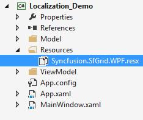
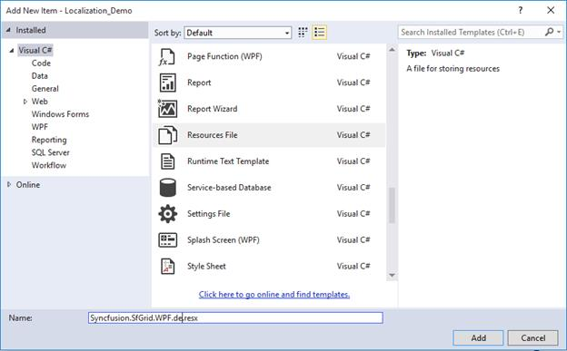
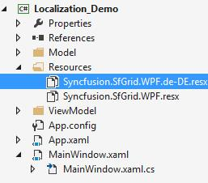
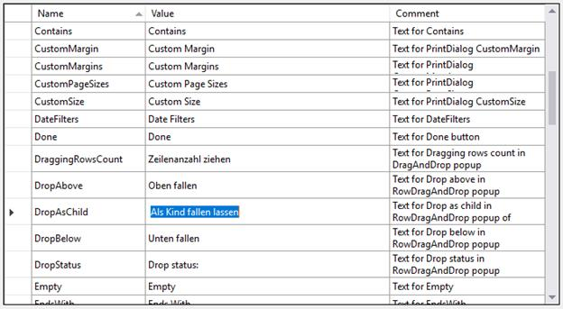
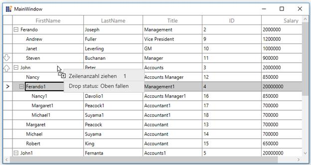
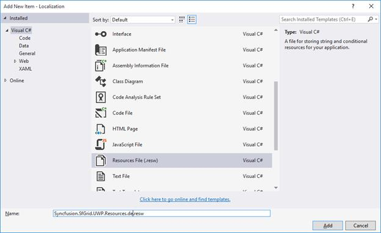
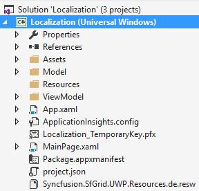
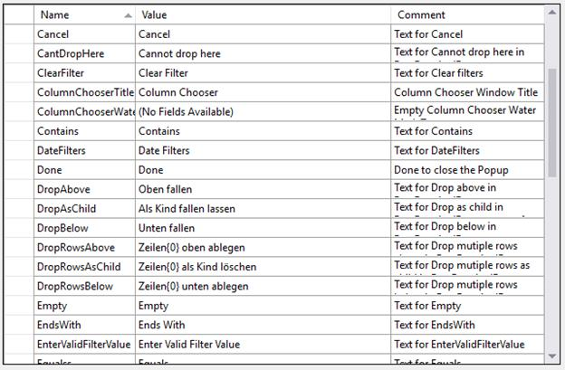
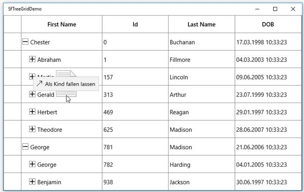

# How to Localize the Drag and Drop Window Text in WPF / UWP TreeGrid?

This example illustrates how to localize the drag and drop window text in [WPF TreeGrid](https://www.syncfusion.com/wpf-controls/treegrid) and [UWP TreeGrid](https://www.syncfusion.com/uwp-ui-controls/treegrid) (SfTreeGrid).

To localize the TreeGrid, drag and drop window based on **CurrentUICulture** using resource files, follow the below steps.

### For WPF:

1. Create new folder and named as **Resources** in your application. 

2. Add the default resource file of TreeGrid into **Resources** folder. You can download the Syncfusion.SfGrid.WPF.resx [here](https://github.com/SyncfusionExamples/how-to-localize-the-drag-and-drop-window-text-in-treegrid/blob/ES-975464/WPF/SfTreeGridDemo/Resources/Syncfusion.SfGrid.WPF.resx).

3. Right-click on the Resources folder, select **Add** and then **NewItem**.

4. In Add New Item wizard, select the **Resource File** option and name the filename as **Syncfusion.SfGrid.WPF.&lt;culture name&gt;.resx**. For example, you have to give name as **Syncfusion.SfGrid.WPF.de.resx** for German culture.

5. The culture name that indicates the name of language and country.

6. Now, select Add option to add the resource file in **Resources** folder.

7.Add the Name/Value pair in Resource Designer of **Syncfusion.SfGrid.WPF.de.resx** file and change its corresponding value to corresponding culture.

### For UWP:

1. Right-click on the project, select **Add** and then **NewItem**.

2. In Add New Item wizard, select the **Resource File** option and name the filename as **Syncfusion.SfGrid.UWP.Resources.&lt;culture name&gt;.resw**.

3. For example, you have to give name as **Syncfusion.SfGrid.UWP.Resources.de.resw** for German culture.

4. The culture name that indicates the name of language and country.

5. Now the resource file is added.

6. Add the Name/Value pair in Resource Designer of **Syncfusion.SfGrid.UWP.Resources.de.resw** file and change its corresponding value to corresponding culture.

You can get the TreeGrid's key from default resource [Syncfusion.SfGrid.UWP.Resources.resw](https://github.com/SyncfusionExamples/how-to-localize-the-drag-and-drop-window-text-in-treegrid/blob/ES-975464/UWP/Resources/Syncfusion.SfGrid.UWP.Resources.resw).

